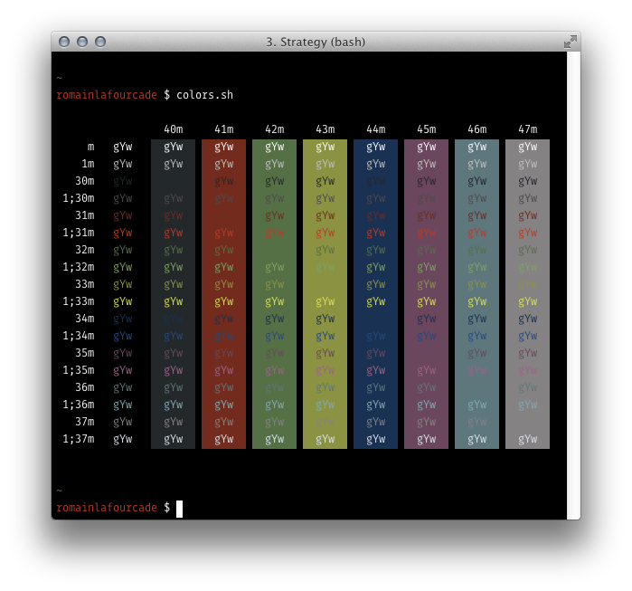

# I switched back to Terminal.app so this project can be considered officially abandoned.

Apprentice — A companion to [my eponymous Vim colorscheme](https://github.com/romainl/Apprentice).

Low contrast — What it says on the tin.

xterm dark — The ugly basics.

xterm light — The ugly basics.

Cold Wave — Pretty but not really usable.

Sepia dark — Pretty but not really usable.

Sepia light — Pretty but not really usable.

Boulogne — My default theme for about 10 years.

Goldsworthy — Inspired by the work of Andy Goldsworthy.

ISO — Red, green, yellow, blue, magenta, cyan have the same brightness.

Strategy — Halfway between Boulogne and ISO.

